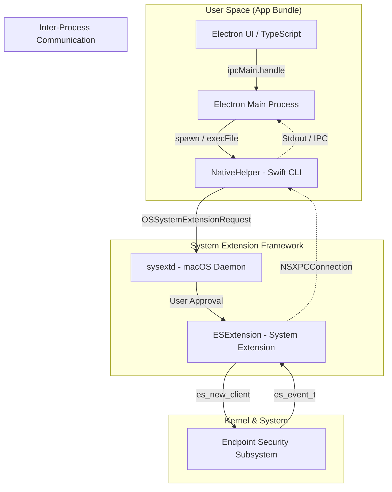

# Secured App POC

# Overview

```mermaid
graph TD
    subgraph "User Space (App Bundle)"
        UI[Electron UI / TypeScript] -- "ipcMain.handle" --> MP[Electron Main Process]
        MP -- "spawn / execFile" --> NH[NativeHelper - Swift CLI]
    end

    subgraph "System Extension Framework"
        NH -- "OSSystemExtensionRequest" --> SYSD[sysextd - macOS Daemon]
        SYSD -- "User Approval" --> ESE[ESExtension - System Extension]
    end

    subgraph "Kernel & System"
        ESE -- "es_new_client" --> K[Endpoint Security Subsystem]
        K -- "es_event_t" --> ESE
    end

    subgraph "Inter-Process Communication"
        ESE -. "NSXPCConnection" .-> NH
        NH -. "Stdout / IPC" .-> MP
    end
```
